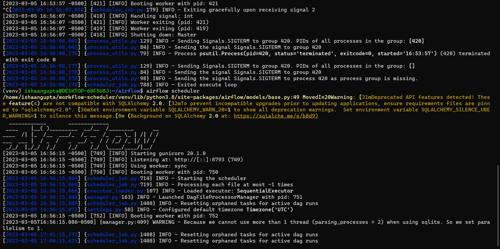
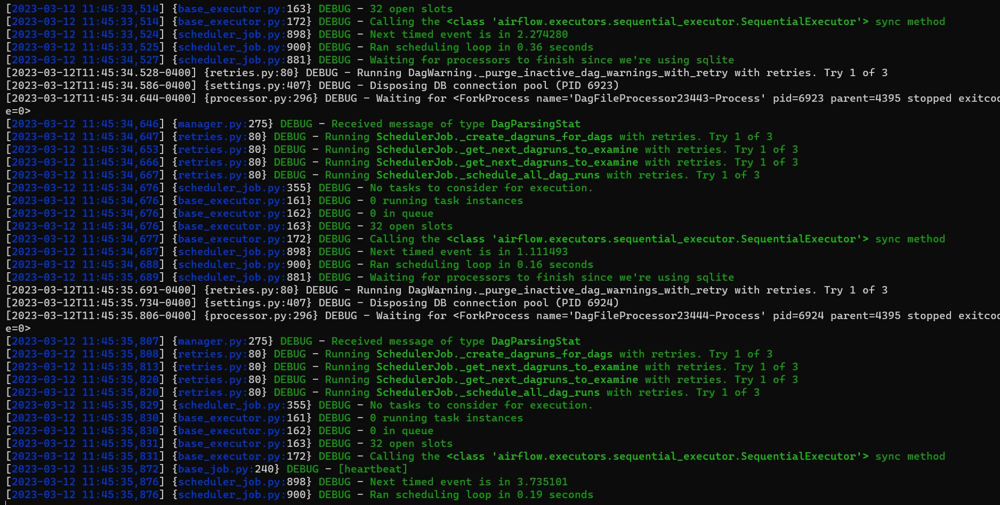
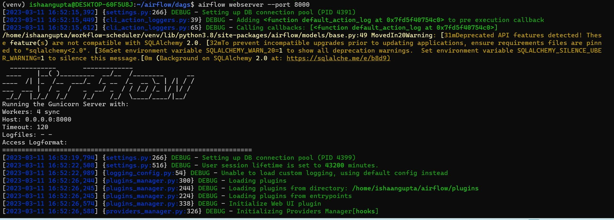
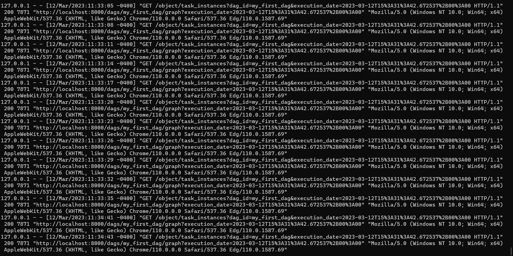
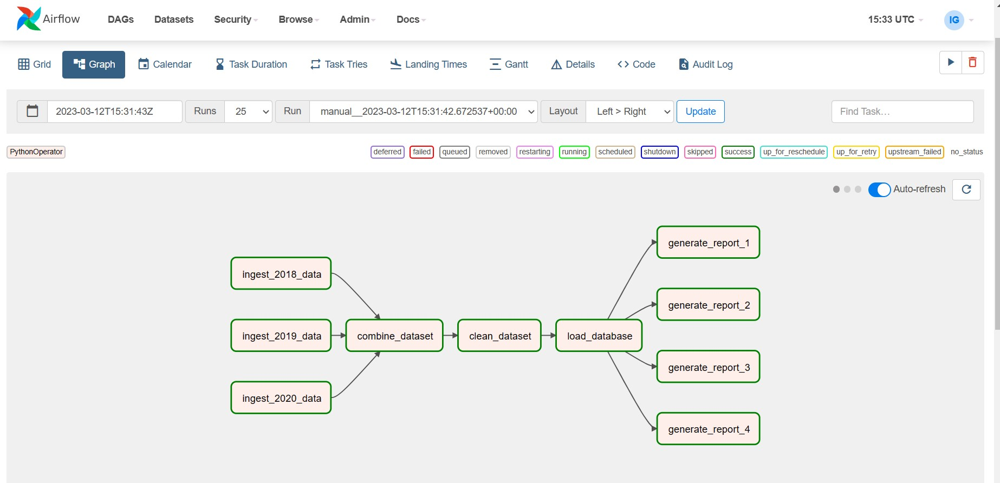
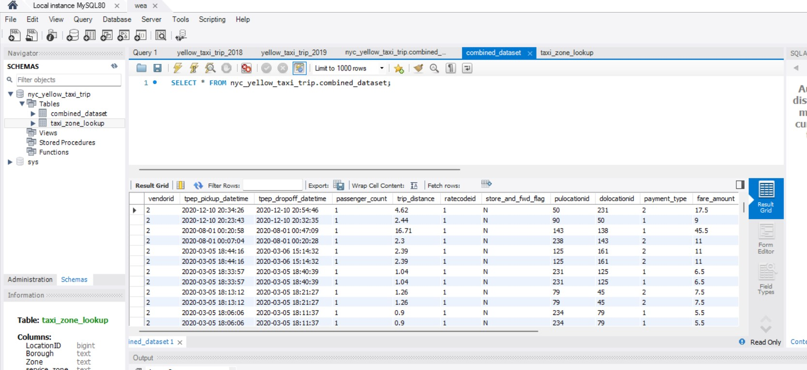
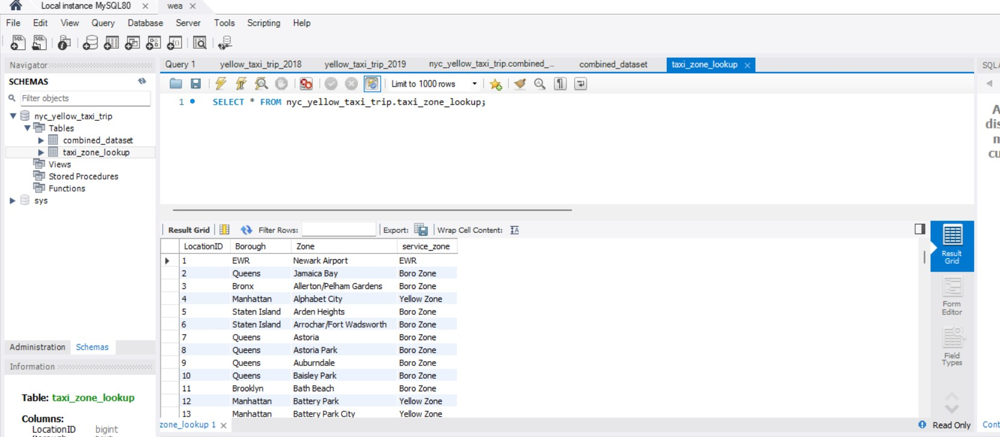

# Workflow-Scheduler
Orchestrating workflow scheduling framework for NYC transportation reporting using Apache Airflow        
    


### Install Apache Airflow (in WSL)
```bash
$ virtualenv venv
$ source venv/bin/activate.
$ pip3 install apache-airflow
```
### Setup Apache Airflow (in WSL)
```bash
$ cd ~/airflow
$ airflow db init
$ mkdir dags 
```
### Create a new Airflow User: 
```bash
$ airflow users create --username <username> --password <password> --firstname <first name> --lastname <last name> --role Admin --email <email>
$ airflow users list
```

### Start Airflow Scheduler
```bash
$ airflow scheduler
```

#### Airflow Scheduler Logs


### Start Airflow Webserver
```bash
$ airflow webserver --port 8000
```


#### Airflow Webserver Logs


The web browser should open browser and go to http://localhost:8000 

### Install MySQL server in WSL
```bash
$ sudo apt update && sudo apt upgrade
$ sudo apt install mysql-server
$ mysql --version
$ mysql -u root -p
```
#### Connect MySQL Server in WSL with MySQL Workbench. Check out this: https://www.youtube.com/watch?v=DBsyCk2vZw4

### Worflow Framework 
    1. Ingest 2018, 2019, 2020 Dataset = Ingesting Data from JSON files to Pandas Dataframes
    2. Combine Dataset = Combined the 3 Dataframes
    3. Cleane Dataset 
        (a) Discarded data entries with datatime field values outside 2018, 2019, 2020
        (b) Discard columns with no more than 1 unique entries
    4. Load Database = Cleaned dataset loaded in MySQL
    5. Generated reports     


### Load Database (Cleaned dataset loaded in MySQL)
#### Combined 2018-2020 NYC Taxi trip Dataset

#### Taxi and Zone Lookup Dataset



